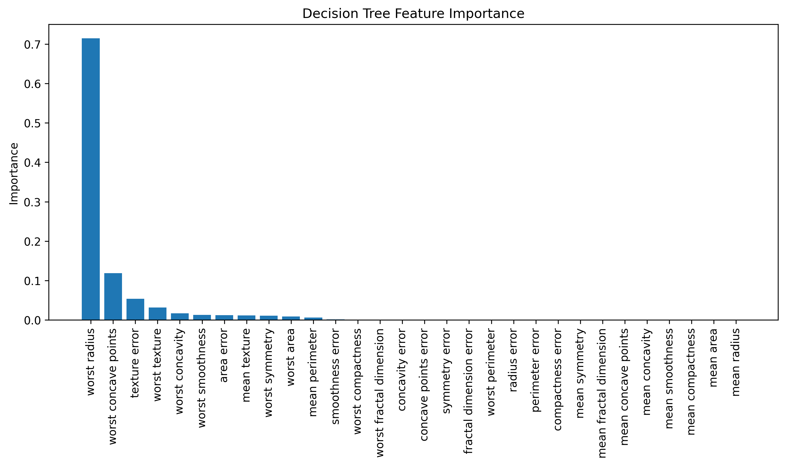
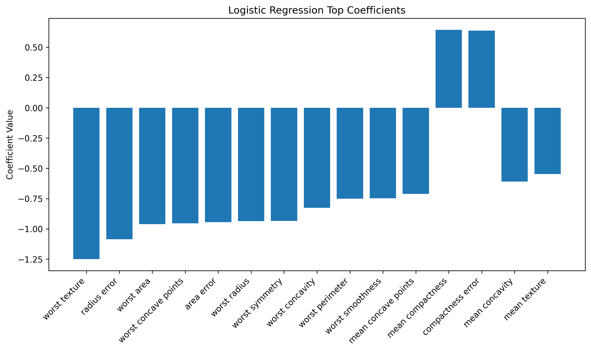

# 03 — Machine Learning Classifier

This project demonstrates a **supervised machine learning workflow** applied to the **Telco Churn dataset** (or fallback dataset for testing).  
It includes preprocessing, training multiple classifiers, evaluating performance, and generating reports + visuals.

---

## 📂 Project Structure

## ⚙️ Workflow
- Data preprocessing (scaling, encoding, cleaning)
- Train Logistic Regression + Decision Tree
- Evaluate with accuracy, F1, confusion matrix
- Save models, metrics, and visuals

## 📊 Results Snapshot
- Logistic Regression Accuracy: 0.97
- Decision Tree Accuracy: 0.92

👉 [See full report with visuals](reports/report.md)

## 📈 Visuals

### Decision Tree Feature Importance

### Logistic Regression Coefficients

👉 [See full report with more details](reports/report.md)

