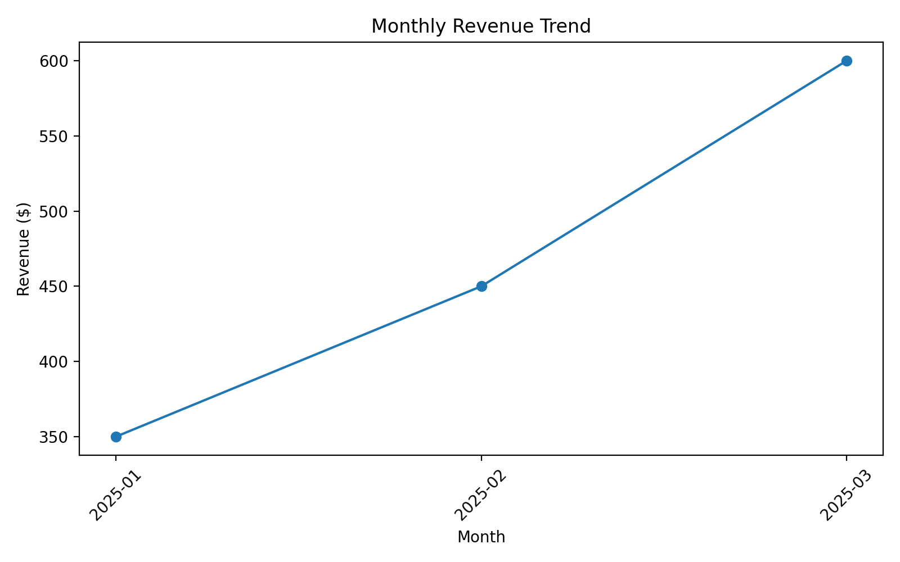
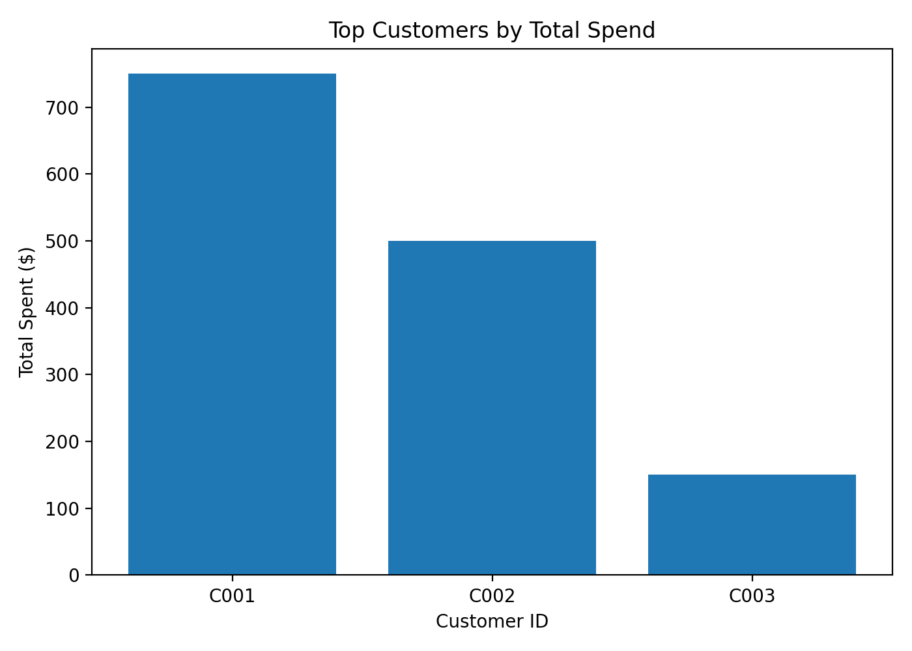

# Monica M. Wilson — Data Science Portfolio

Welcome! 👋 I’m Dr. Monica M. Wilson, a business professor and consultant expanding into data science and machine learning.  
This portfolio showcases my journey in coding, data analysis, and applied machine learning — with projects that connect real-world problems to practical solutions.  

---

## 🔥 About Me
- 🎓 Doctor of Business Administration (DBA), MBA, MSIS  
- 👩🏽‍🏫 Adjunct Faculty of Business | Adjunct Dissertation Committee Member | Executive Director| Published Author | Business Consultant 
- 💡 Passionate about teaching, analytics, and transforming raw data into insights  
- ⚙️ Skills: Python, Pandas, SQL, scikit-learn, Streamlit, data visualization

---

## 📂 Featured Projects
- **01-data-cleaning-eda** → Exploratory data analysis & cleaning on sample datasets  
- **02-sql-analytics** → Business questions answered with SQL queries & reports  
- **03-ml-classifier** → Machine learning model (classification) with performance report  
- **04-nlp** → Natural language processing (sentiment analysis & text classification)  
- **05-dashboard** → Interactive Streamlit dashboard for KPIs & insights  

---
## 📊 Featured Work

### 1) SQL Analytics — Dummy Orders Database
I built a SQLite database and ran queries to answer business questions.

- **Skills used:** SQL, SQLite, Python, Pandas, Matplotlib
- **Highlights:**
  - Identified top customers by total spend
  - Charted monthly revenue trends

**Chart Examples:**  
  


---

### 2) Exploratory Data Analysis (EDA) — Tips Dataset
Explored restaurant tipping behavior and summarized insights.

- **Skills used:** Python, Pandas, Matplotlib
- **Highlights:**
  - Total bill amounts are right-skewed (a few high checks)
  - Average tips are higher on weekends
  - Tip size rises with total bill (positive relationship)

<!-- Optional images below — add these if you saved EDA charts to 01-data-cleaning-eda/reports/ -->
<!--


-->


## 🚀 How to Run Projects
Clone the repo, create a virtual environment, and install requirements:
```bash
git clone https://github.com/monicawilsonwork-max/data-science-portfolio.git
cd data-science-portfolio
python -m venv .venv
source .venv/bin/activate   # On Windows: .venv\Scripts\activate
pip install -r requirements.txt
